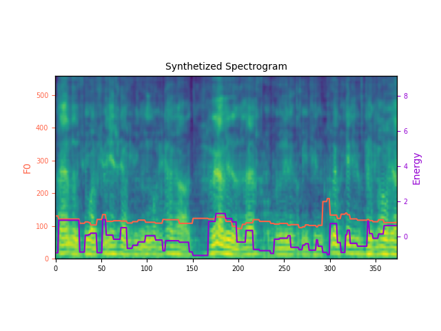
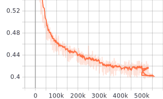

# High-Quality-Voice-Cloning

# Custom Model

This is a Custom Voice Cloning Model

## Dependencies

You can install the Python dependencies with

```
pip3 install -r requirements.txt
```

# Config

Here are the config files used to train the single/multi-speaker TTS models.

- LibriTTS: suggested configuration for LibriTTS dataset.

Setup Your model.yaml, train.yaml and preprocess.yml before everything inside config

# Preprocessing

```
python prepare_align.py config/{Your voice Dataset}/preprocess.yaml
```

to align the corpus and then run the preprocessing script - Followed by

```
python preprocess.py config/{Your voice Dataset}/preprocess.yaml
```

# Training

```
python3 train.py -p config/{Your voice Dataset}/preprocess.yaml -m config/{Your voice Dataset}/model.yaml -t config/{Your voice Dataset}/train.yaml
```

# Inference

You can download the [pretrained models] https://drive.google.com/drive/folders/1GCuMiniTQZHeTwHEgAo6dS9bQquvVDs5?usp=drive_link
and put them in output/ckpt/{Your voice Dataset}/

For vocoder,download pretrained from https://drive.google.com/drive/folders/1GCuMiniTQZHeTwHEgAo6dS9bQquvVDs5?usp=drive_link and put it in Hifi-Gan

```
python3 synthesize.py --text "YOUR DESIRED TEXT" --restore_step 900000 --mode single -p config/{Your voice Dataset}/preprocess.yaml -m config/{Your voice Dataset}/model.yaml -t config/{Your voice Dataset}/train.yaml
```

<audio controls>
  <source src="[audio.wav](https://github.com/SiddantaK/High-Quality-Voice-Cloning/blob/main/audio.wav)" type="audio/wav">
  Your browser does not support the audio element.
</audio>

<div align="center">
<a></a>
</div>

<div align="center">
<a></a>
</div>
